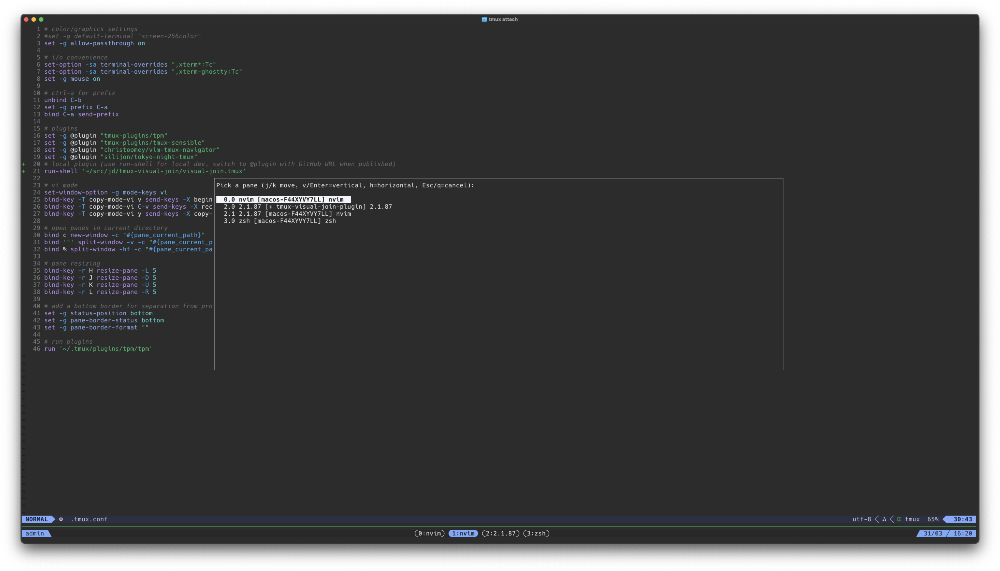

# tmux-visual-join

A tmux plugin that provides an interactive popup for pulling panes from any session into your current window.



## Installation

### With [TPM](https://github.com/tmux-plugins/tpm)

Add to your `.tmux.conf`:

```tmux
set -g @plugin 'silijon/tmux-visual-join'
```

Then press `prefix + I` to install.

### Manual

Clone the repo and source it in your `.tmux.conf`:

```tmux
run-shell '/path/to/tmux-visual-join/visual-join.tmux'
```

## Usage

Press `prefix + m` to open the pane picker popup. A tab strip across the top shows all open sessions; the current session's tab is pre-selected. Tab and Shift-Tab navigate between sessions; panes from the active session are listed below.

| Key              | Action                              |
|------------------|-------------------------------------|
| `j` / `Down`     | Move selection down                 |
| `k` / `Up`       | Move selection up                   |
| `Tab`            | Next session tab                    |
| `Shift-Tab`      | Previous session tab                |
| `1`-`9`          | Jump to nth session tab             |
| `v` or `Enter`   | Join pane as vertical split (side by side) |
| `h`              | Join pane as horizontal split (stacked)    |
| `Esc` / `q`      | Cancel                              |

When only one session exists the tab strip is hidden and the popup looks identical to the previous version.

The bottom of the popup shows a live preview of the currently highlighted pane's content, updated as you move the selection.

## Configuration

Override the default keybinding in `.tmux.conf`:

```tmux
set -g @visual-join-key 'P'
```

## Requirements

- tmux 3.2+ (for `display-popup` support)
- bash 4+
